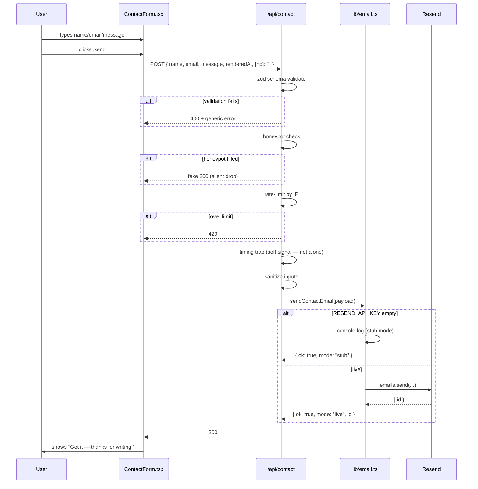
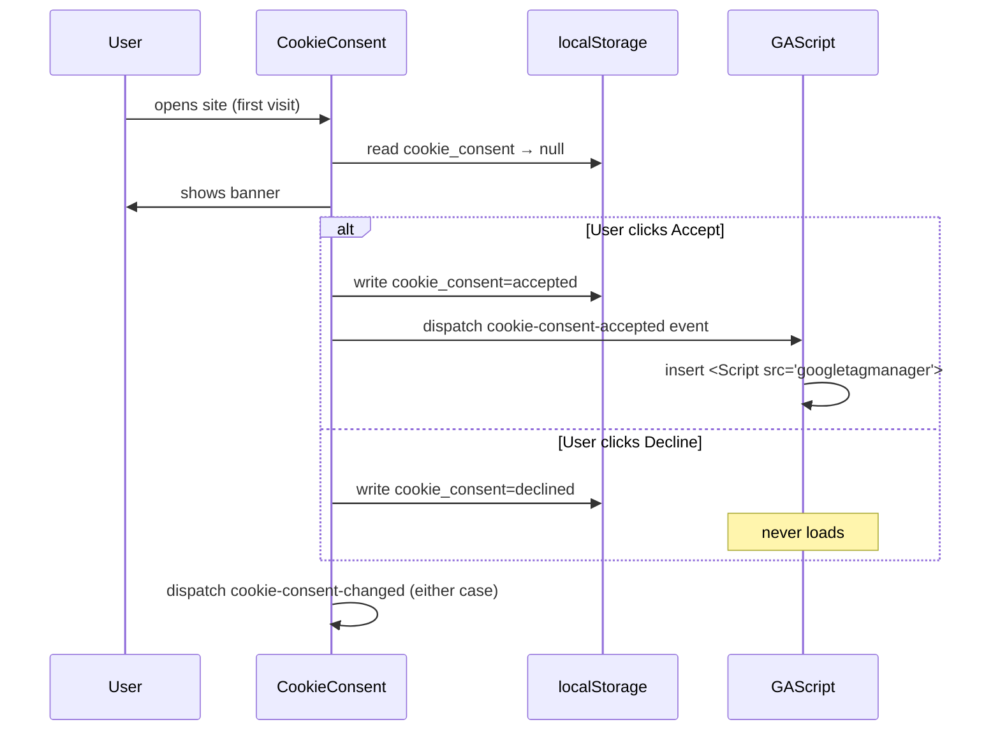
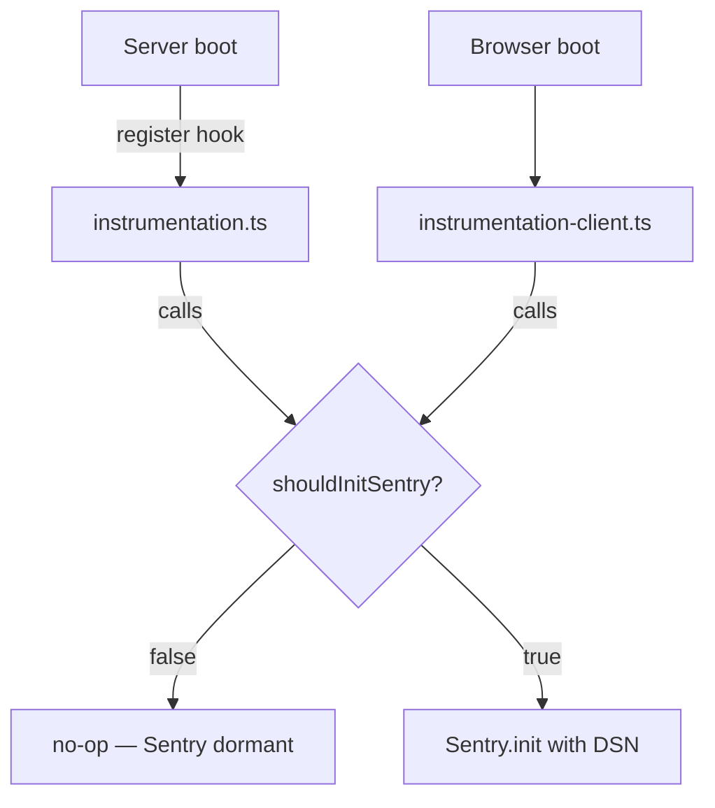

# ARCHITECTURE.md

## Big picture

```mermaid
flowchart TB
  Browser[User's Browser] -->|HTTPS| Vercel[Vercel Edge / Node]
  Vercel -->|render| App[Next.js App Router]
  App -->|read| Env[lib/env.ts]
  App -->|render| Pages[Pages: / /contact /privacy /terms /cookies]
  App -->|POST| Contact[/api/contact route handler]
  Contact -->|sanitize + rate-limit + honeypot| Email[lib/email.ts]
  Email -->|when configured| Resend[Resend API]
  Email -->|stub mode when not| Logs[server console]
  App -->|consent given| GA[Google Analytics 4]
  App -->|prod errors| Sentry[Sentry]
```

## Pages and routes

| URL | File | Notes |
|---|---|---|
| `/` | `app/page.tsx` | Hero → DishCarousel → NumbersBand → StoryTease → Reviews → FranchiseTease |
| `/contact` | `app/contact/page.tsx` | ContactForm |
| `/privacy` | `app/privacy/page.tsx` | Static legal copy |
| `/terms` | `app/terms/page.tsx` | Static legal copy |
| `/cookies` | `app/cookies/page.tsx` | Static legal copy |
| `POST /api/contact` | `app/api/contact/route.ts` | zod → honeypot → rate-limit → sanitize → email |

## Layout chrome

`app/layout.tsx` (RootLayout) wraps every page with:

1. `<Navbar />` — sticky header
2. `<div className="flex-1">{children}</div>` — page content (NOT `<main>`; pages own that)
3. `<Footer />` — three-column footer
4. `<CookieConsent />` — first-visit banner
5. `<GAScript gaId={process.env.NEXT_PUBLIC_GA_ID} />` — GA loader (no-op without consent)
6. `<MobileOrderBar />` — fixed bottom CTA on mobile only

## Contact form sequence



### Defence-in-depth on the form

| Layer | What it stops |
|---|---|
| zod schema | Malformed payloads (missing fields, oversize message, bad email format) |
| Honeypot | Naive bots that fill every field. Hard block — fake 200, no email sent. |
| Rate limit (3 per 10 min by IP) | Abusive automation. Returns 429. |
| Timing trap | Forms submitted in <1 second from render. Soft signal — flagged in logs, NOT silently dropped (per master prompt policy: a fast paster can legitimately submit in 1 second). |
| Sanitize | Stripping control chars + trimming + length caps before the email body |

## Cookie consent flow



GAScript also reads localStorage on mount, so refreshing the page after Accept doesn't re-show the banner and re-loads GA without re-clicking.

## Sentry init



`shouldInitSentry()` is `true` only when **both**:
- `NEXT_PUBLIC_SENTRY_DSN` is set (and non-empty)
- `NODE_ENV === "production"`

## Build output

`output: "standalone"` in `next.config.ts` means `npm run build` produces a self-contained server in `.next/standalone/`. Deployable to any Node host; what we use for the Vercel deploy.

## Files that talk to env vars

Only `lib/env.ts` reads `process.env` for app config. The rest of the app imports `env` from there. Two exceptions, justified:

1. `lib/sentry.ts` — reads `NEXT_PUBLIC_SENTRY_DSN` and `NODE_ENV` at call time so tests can mutate.
2. `instrumentation.ts` — reads `NEXT_RUNTIME` (set by Next itself, not our config).
