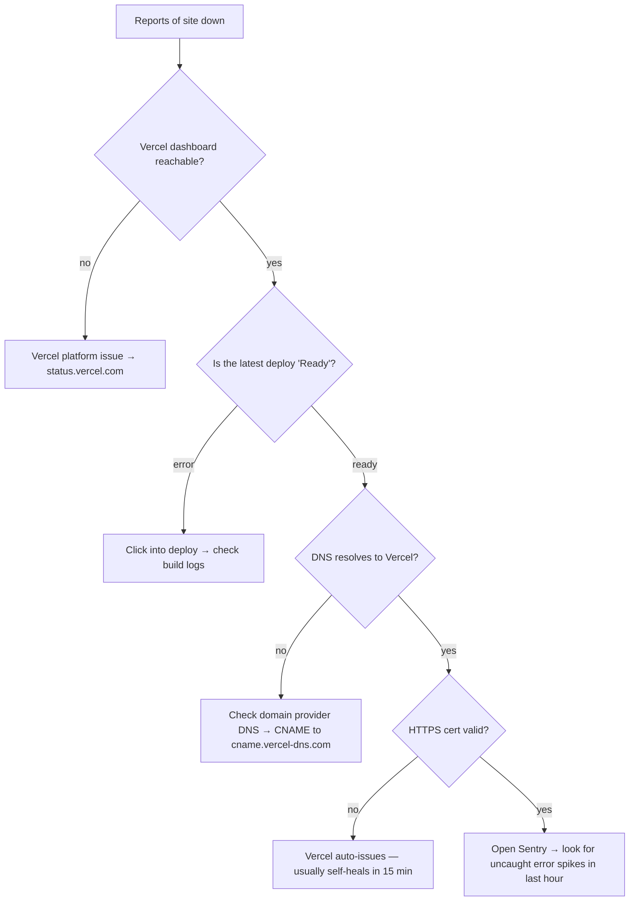
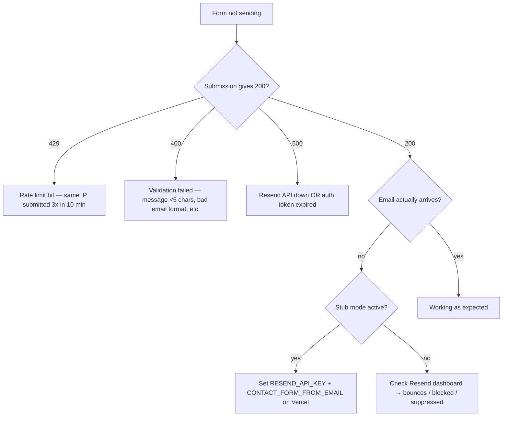
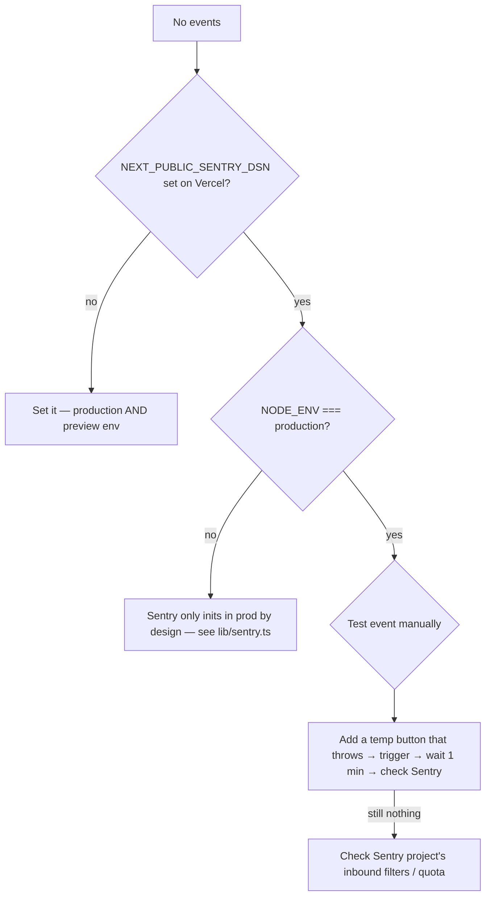

# ERRORS.md — Error catalogue & decision trees

## "The site is down"

## "The contact form doesn't send"

## "I get a CSP violation in the console"

| Violation | Cause | Fix |
|---|---|---|
| `Refused to load script 'X'` | A new external script was added without updating CSP | Add the host to `script-src` in `lib/security-headers.ts` |
| `Refused to apply inline style` | Pasted inline `style=` attribute somewhere | Move it to a Tailwind class. `style-src 'unsafe-inline'` is already permitted but only for next/font. |
| `Refused to connect to 'X'` | New API endpoint or Sentry tunnel | Add to `connect-src` |
| `Refused to load font` | New font source other than self-hosted | Use `next/font` to self-host instead of whitelisting |

## "The cookie consent banner won't dismiss"

| Cause | Fix |
|---|---|
| Browser dev tools have localStorage disabled | Re-enable in Application → Storage |
| `cookie_consent` already in localStorage but banner showing anyway | Hard refresh — banner reads localStorage on mount |
| Hydration mismatch warning in console | A useEffect ran before mount — see `components/consent/CookieConsent.tsx` for the SSR-safe pattern |

## "Tests failing only in CI, passing locally"

| Symptom | Cause | Fix |
|---|---|---|
| `Cannot find module '@/...'` | tsconfig paths not in sync with jest moduleNameMapper | Confirm both list the same alias |
| `window is not defined` | Node-env test imports a module that touches window | Add the typeof window guard in jest.setup.ts |
| `act() warnings` only in CI | Slower CI runner exposes a useEffect race | Wrap state updates in `await act(() => { ... })` |
| Snapshot diff | A new package version pinned differently in CI | Make sure `package-lock.json` is committed |

## "Sentry dashboard is empty"

## Common dev-time errors

| Error | What it actually means | Fix |
|---|---|---|
| `Hydration failed because the server rendered HTML didn't match the client` | A component renders different output server vs client (most common: localStorage read, `Date.now()`, or `Math.random()` outside useEffect) | Move that read into `useEffect` |
| `Cannot use both x: and useState` in a server component | Tried to use a hook in a non-`"use client"` file | Add `"use client"` at the top, or move the stateful chunk into a child client component |
| `Maximum update depth exceeded` | A useEffect has no dependency array and updates state | Add the dependency array |
| `Module not found: Can't resolve 'X'` after `npm install` | Lockfile out of sync | `rm -rf node_modules package-lock.json && npm install` |
