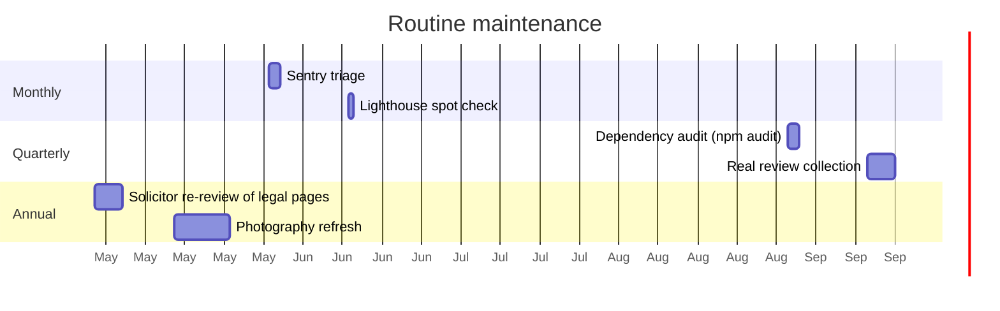

# MAINTENANCE.md

## Vercel deploy setup (one-time, post-launch)

1. Sign in to [vercel.com](https://vercel.com) with the GitHub account that owns `Essam-Noureldin/southern_eats`.
2. **Add New → Project** → import the repo.
3. **Root Directory**: `site/` (the Next.js app lives in a subfolder).
4. **Framework**: Next.js (autodetected).
5. **Build Command**: `npm run build` (autodetected — but confirm; we need the postbuild hook).
6. **Environment Variables**: paste in every var from `.env.example`. **Set them for both Production AND Preview environments** — preview branches won't build without them.
7. Click Deploy.

After the first deploy:
- Every push to `main` auto-deploys to production.
- Every feature branch gets a preview URL — automatically.
- You never run `vercel deploy` from the CLI again.

## Maintenance rhythm



### Monthly

- **Sentry triage** — open the Sentry dashboard, group new errors, decide which need fixes vs which are noise. Tag and resolve the noise.
- **Lighthouse** — run on the homepage. If a Performance/A11y/SEO score has dropped >5 points from baseline, investigate.

### Quarterly

- **`npm audit --audit-level=high`** — fix any high/critical findings. Moderates are usually transitive deps that can wait.
- **Real review collection** — replace any remaining mock content in `lib/reviews.ts` with real, attributed, permission-confirmed quotes.

### Annual

- **Solicitor review of legal pages** — Privacy / Terms / Cookies. Law changes; copy needs to track it.
- **Photography refresh** — food shots age fast. Aim for fresh shoot annually.

## Updating dependencies

```bash
npm outdated
```

For each major-version bump:

1. Read the package's CHANGELOG / migration guide.
2. Branch `feature-bump-<pkg>`.
3. `npm install <pkg>@latest`.
4. Run the full test suite. Fix any breaks.
5. Run the build. Fix any breaks.
6. Manual smoke in the browser at 375px and desktop.
7. Merge → push → wait for the Vercel preview to deploy → re-smoke on the preview URL → merge to main.

> ⚠️ **Never bump Next.js without reading its release notes.** Past Next majors have shipped breaking changes (async `params`, `instrumentation.ts` location, Turbopack default).

## Adding an environment variable

1. Add it to `lib/env.ts` zod schema (with `optionalString` if it can be empty).
2. Add it to `.env.example` with an inline comment explaining what it's for.
3. Add it to **both** Production and Preview env on Vercel.
4. Update `docs/README.md` → "Required env vars" table.

## Rolling back a bad deploy

Two options:

**A. Vercel rollback** (fastest):
1. Vercel dashboard → Deployments
2. Find the last good deploy
3. ⋮ menu → Promote to Production

**B. Git revert** (cleanest history):
```bash
git revert <bad-commit-sha>
git push origin main
```
Vercel auto-deploys the revert.

## When the site goes down

Follow the decision tree in `docs/ERRORS.md` → "The site is down".

## Backups

Vercel doesn't back up the source — that's git's job. Make sure both you and the client have GitHub access to the repo. The deploy artefacts on Vercel are reproducible from any commit, so they don't need separate backup.

The contact-form submissions are emailed to `CONTACT_FORM_TO_EMAIL` and not stored on the server — your inbox is the archive.
