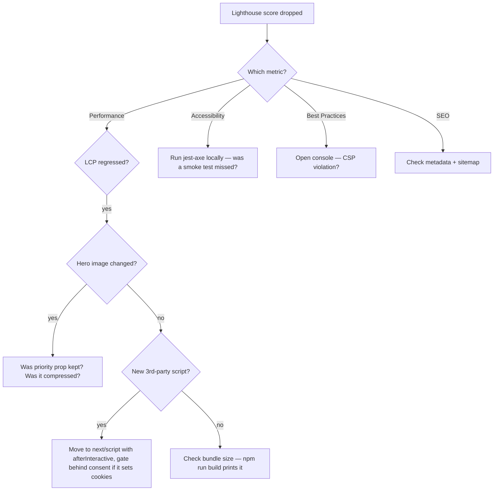

# PERFORMANCE.md

## Targets (pre-launch — actuals filled after first live deploy)

| Metric | Target | Why |
|---|---|---|
| Lighthouse Performance (mobile) | ≥ 90 | Mobile is the primary visit path for "near me" searches |
| Lighthouse Performance (desktop) | ≥ 95 | Desktop is forgiving — easy win |
| Lighthouse Accessibility | 100 | Legal exposure (ADA / Equality Act) |
| Lighthouse Best Practices | ≥ 95 | Catches CSP / HTTPS / deprecated API issues |
| Lighthouse SEO | 100 | Marketing site — SEO is the value prop |
| LCP (Largest Contentful Paint) | < 2.5s | Core Web Vitals — affects ranking |
| INP (Interaction to Next Paint) | < 200ms | Replaces FID in 2024+ Core Web Vitals |
| CLS (Cumulative Layout Shift) | < 0.1 | Layout jumps look amateur |
| Total page weight (homepage) | < 1.5 MB | Mobile data realism |

> ⚠️ **Targets only — actuals captured against the live URL pre-launch.** Localhost scores mislead because they don't include real network latency, real CDN behaviour, or real mobile CPU throttling.

## Animation rule

Every animated element MUST:
- Use `transform` and `opacity` only (GPU-composited, no layout reflow)
- Have a `prefers-reduced-motion: reduce` fallback
- Be measured to not cause layout shift (test in Chrome DevTools Performance panel)

Already enforced in:
- `tests/smoke/*` — jest-axe sees `prefers-reduced-motion: reduce` (mocked in `jest.setup.ts`) so animated elements stay inert
- `next.config.ts` — no perf-hostile features enabled

## What's already optimised

| Area | What we did |
|---|---|
| Fonts | `next/font/google` self-hosts at build time. No runtime requests to Google. |
| Images | All via `next/image` — AVIF/WebP, responsive sizes, lazy loading, priority on hero |
| Maps | Outbound directions link instead of Google Maps iframe — saves ~500 KB |
| Carousel | Native CSS scroll-snap, no carousel library |
| Icons | Inline SVG instead of lucide-react — saves ~50 KB |
| Bundle | `output: "standalone"` + Next 16 default code-splitting |
| GA | Loads on-consent only via `next/script strategy="afterInteractive"`, not at first paint |
| Sentry | Loads only in production — dev/preview don't pay the SDK weight |

## Regression decision tree



## How to run Lighthouse

### Locally (relative measurement only)

1. `npm run build && npm start` (production build, NOT `npm run dev` — dev mode has dev tools that hurt scores)
2. Open Chrome DevTools → Lighthouse tab
3. Mode: Navigation. Device: Mobile. Categories: all.
4. Run.

### On the live URL (the one that matters)

1. After Vercel deploys
2. Open [PageSpeed Insights](https://pagespeed.web.dev/)
3. Enter the live URL
4. Capture all four scores + the LCP / INP / CLS numbers
5. Paste into the table above

## Bundle size monitoring

Add this to the maintenance rhythm:

```bash
npm run build
```

Look at the route table at the end. Watch for:
- Routes growing past 200 KB First Load JS
- A new external dependency more than 100 KB

If a new dependency adds > 100 KB and isn't critical-path, consider:
- A lighter alternative
- Dynamic import (`const Lib = await import('lib')`) so it loads on demand
- Server-only usage (so it doesn't ship to the client at all)

## Things to NOT do for perf

| ❌ Tempting fix | Why it's wrong |
|---|---|
| Disable Sentry to lighten the bundle | Sentry only loads in production with DSN — already gated. |
| Inline hero image as base64 | Defeats Next's image optimisation pipeline + caching. |
| Add Cloudflare in front of Vercel | Vercel already uses Cloudflare's network — redundant. |
| Convert to fully static HTML | Sacrifices the contact form, GA gating, and Sentry hooks. |
