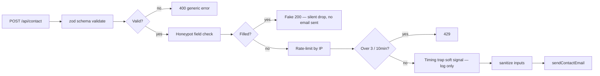

# SECURITY.md

## Threat model — small-business marketing site

The realistic threats for this site are not nation-state attackers. They are:

| Threat | Likelihood | Impact | Mitigation |
|---|---|---|---|
| **Spam bots filling the contact form** | High | Inbox clutter, possible blacklisting of `CONTACT_FORM_FROM_EMAIL` | Honeypot + rate limit + zod schema |
| **Cross-Site Scripting (XSS)** in user-supplied content rendered without escaping | Low (we don't render user content publicly) | Defaced page, cookie theft | CSP + React's default escaping |
| **Clickjacking** (Sam's site embedded in an attacker's iframe to phish customers) | Low | Reputation damage | `X-Frame-Options: DENY` + `frame-src 'none'` in CSP |
| **HTTPS downgrade attack** | Low (HTTPS-only on Vercel) | Credential interception | HSTS with preload |
| **Dependency supply chain compromise** | Moderate over time | Code execution in build/run | `npm audit` rhythm + version pinning |
| **Source-map leak** revealing internal logic | Low impact | Aids reverse engineering | Sentry uploads but doesn't serve maps; production bundle is minified |
| **Email harvesting** from public mailto: links | High | Spam to client's inbox | We use a contact form, not a mailto: link |

## What's in place

### `next.config.ts` security headers (via `lib/security-headers.ts`)

Each header explained:

| Header | What it does | Why this value |
|---|---|---|
| **Content-Security-Policy** | Browser-enforced rule list of which scripts/images/fonts the page is allowed to load | See CSP walkthrough below |
| **X-Frame-Options: DENY** | Forbids any other site from putting our site in an iframe | Stops clickjacking attacks |
| **X-Content-Type-Options: nosniff** | Forbids browsers from "MIME-sniffing" (guessing file types) | Stops type-confusion attacks |
| **Referrer-Policy: strict-origin-when-cross-origin** | When the user clicks an external link, send the origin only — not the full URL | Privacy: doesn't leak query params or paths |
| **Permissions-Policy: camera=(), microphone=(), geolocation=()** | Disables APIs we don't use | Stops a compromised script from prompting for camera access |
| **Strict-Transport-Security: max-age=63072000; includeSubDomains; preload** | Tells the browser "this domain is HTTPS-only for 2 years, even on subdomains, and is on the preload list" | Stops downgrade attacks |

### CSP walkthrough

```
default-src 'self'
script-src 'self' 'unsafe-inline' https://www.googletagmanager.com https://www.google-analytics.com
style-src 'self' 'unsafe-inline'
font-src 'self'
img-src 'self' data: https://www.google-analytics.com
connect-src 'self' https://www.google-analytics.com https://o*.ingest.sentry.io
frame-src 'none'
object-src 'none'
base-uri 'self'
form-action 'self'
```

| Directive | Why |
|---|---|
| `default-src 'self'` | Catch-all: only same-origin loads. Every following directive is a relaxation of this. |
| `script-src 'unsafe-inline'` | Required for Next.js inline bootstrap scripts. Could be replaced with nonces, but only with dynamic rendering. |
| `script-src https://www.googletagmanager.com` | GA4 loads from here when consent is given. |
| `style-src 'unsafe-inline'` | Tailwind injects some styles inline; React style props need it. |
| `font-src 'self'` | We use `next/font/google` which self-hosts at build time. **No `https://fonts.gstatic.com` whitelist needed.** |
| `connect-src https://o*.ingest.sentry.io` | Sentry events POST here. |
| `frame-src 'none'` | We don't embed iframes. We use an outbound directions link instead of a Google Maps iframe. |

### Contact form defence-in-depth

Defined in `app/api/contact/route.ts`. Order matters:



Honeypot policy note (per master prompt): a single signal alone (timing) **must not** silently drop the submission. Fast pasters can submit in <1s legitimately. Only the honeypot field hard-blocks; timing is a soft signal flagged in logs and combined with rate-limit for the actual response code.

### Rate limit

`lib/rate-limit.ts` — in-memory fixed-window keyed by IP (read from `x-forwarded-for` first, falling back to `x-real-ip`, finally `"unknown"`). Default: 3 submissions per 10 minutes.

> ⚠️ **In-memory only.** Vercel serverless functions can scale across instances; rate limit state isn't shared between instances. For a low-traffic marketing site this is fine. For a high-traffic site, swap for Upstash Redis or a similar distributed counter.

### Honeypot

`lib/honeypot.ts` — generates a deterministic field name that's hidden from real users via:
- `tabIndex={-1}` — keyboard nav skips it
- `aria-hidden="true"` — screen readers skip it
- Off-screen positioning + zero opacity — humans never see it

Bots that fill every field give themselves away. Field name is shared between the form (`components/forms/ContactForm.tsx`) and the API route via `getHoneypotFieldName()` so they can't drift.

### Sanitize

`lib/sanitize.ts` — strips control chars, trims whitespace, enforces length caps before composing the email body. Defence-in-depth: the email body is plain text (no HTML rendering), so XSS isn't a vector — but sanitising still helps against control-char injection in headers.

### Email — Resend with stub mode

`lib/email.ts` — when `RESEND_API_KEY` or `CONTACT_FORM_FROM_EMAIL` is empty, the function logs the payload and returns success without contacting Resend. This means:

- Local dev works without a real Resend account
- Demo Vercel deploys work before DNS is verified
- Preview branches don't accidentally email real recipients

## What's NOT in place (and why)

| Thing | Why not |
|---|---|
| WAF / Cloudflare | Vercel sits in front of Cloudflare's network already. Adding our own would be redundant. |
| 2FA on the site | The site has no user accounts. |
| CAPTCHA on the form | Honeypot + rate limit + timing trap is sufficient for the threat level. CAPTCHAs hurt UX. |
| Database encryption at rest | No database. |
| HSTS preload submission | Done after launch — needs the live domain. |

## Reporting a vulnerability

Email `esam.nourledin@gmail.com` with details. Don't open a public GitHub issue.
